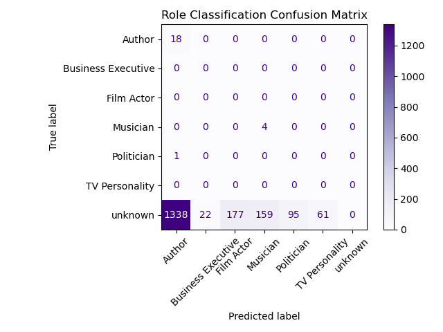

# HMLR NLP Pipeline Evaluation Report

## Classifier: Sub-Category Prediction
- **Model Used:** (unknown)
- **Report:** [`classifier_report.txt`](classifier_report.txt)
- **Confusion Matrix:** 

## Named Entity + Role Classification
- **NER Model:** en_core_web_sm
- **Role Classifier:** valhalla/distilbart-mnli-12-1
- **Roles:** Politician, Musician, TV Personality, Film Actor, Author, Business Executive
- **Report:** [`ner_roles_report.txt`](ner_roles_report.txt)
- **Confusion Matrix:** 

## Summarisation: April Events
- **Model Used:** sshleifer/distilbart-cnn-12-6
- **Stats:** [`summariser_stats.txt`](summariser_stats.txt)
- **Plot:** 

## Output Files
| File | Description |
|------|-------------|
| bbc_subcategories.csv | Sub-category predictions |
| ner_roles.csv | NER + Role predictions |
| april_summaries.csv | Summarised April articles |
| pipeline_timing.csv | Runtime breakdown |
